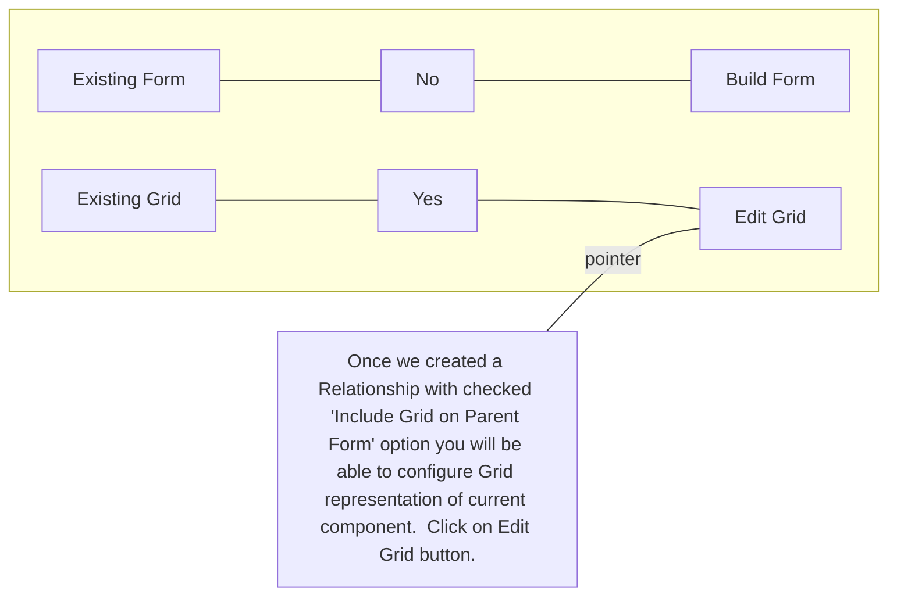
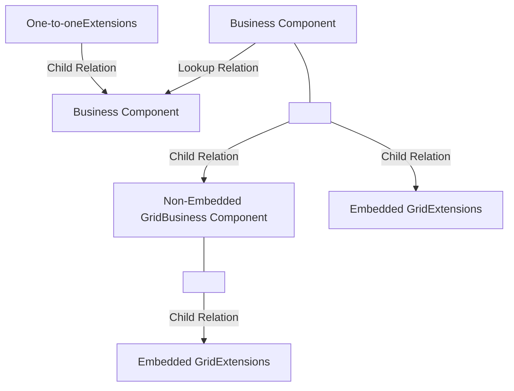

QAD logo

# QAD

## Class 3: QAD Enterprise Platform - Extensions, Relationships, Formulas

By Don Springer

QAD Enterprise Platform

# Topics

* Platform Extensions

* One-to-one Extensions

* Non-Embedded Grids

* Relationships

* Formula Fields

* Business Document

QAD logo

<page_number>2</page_number>

# QAD Enterprise Platform

## Extensions

Extensions is a way to add additional information into existing business component. Platform supports different types of extensions which could be useful in different scenarios.

### Country Industries

Screenshot of QAD Enterprise Platform showing Country Industries grid and CountryExtension panel

An embedded grid provided by the "Many-to-One" extension.

"One to one" extension which represented on the screen as a panel

<page_number>3</page_number>

# Extending an own Business Component

QAD logo

<page_number>3</page_number>

QAD Enterprise Platform

# Extension for the Training Business Component

Screenshot of the QAD Enterprise Platform interface showing the configuration of a new Business Component named "Students" with the "Embedded" option checked.

1. Add a New Business Component “Students”.

2. Select “Embedded” which means the Extension will not appear on the menu and is accessible from “Training”.

QAD logo

<page_number>5</page_number>

QAD Enterprise Platform

# Extension for the Training Business Component

Screenshot of the QAD Enterprise Platform interface showing the Students Business Component configuration. The "Main" tab is selected, displaying fields like Business Component: Students, Type: Standard, and various URIs. The "Fields" section at the bottom has the "Import" button highlighted with a red circle.

As before, use the Import function to create your field definitions.

<page_number>

6
</page_number>

QAD Enterprise Platform

# Extension for the Training Business Component

Screenshot of the QAD Enterprise Platform interface showing an Import dialog box and a file explorer window selecting BusinessComponentStudents.xlsx

Download from the materials for this class the spreadsheet BusinessComponentStudents.xlsx

Click Choose file and use the downloaded file.

Click Import.

<page_number>7</page_number>

QAD Enterprise Platform

# Extension for the Training Business Component

Screenshot of the QAD Enterprise Platform interface showing the Fields configuration for a Business Component. A red circle highlights the "Primary Key" column header and the first four rows (ClassName, Location, FirstName, LastName). A red arrow points from this circle to a text box explaining the primary key setup.

### Fields

| Primary Key | Field     | Field Label | Physical Field | Formula | Lookup | Data Type |
| ----------- | --------- | ----------- | -------------- | ------- | ------ | --------- |
| 1           | ClassName | Class Name  | ClassName      | \[no]   | \[no]  | Character |
| 2           | Location  | Location    | Location       | \[no]   | \[no]  | Character |
| 3           | FirstName | First Name  | FirstName      | \[no]   | \[no]  | Character |
| 4           | LastName  | Last Name   | LastName       | \[no]   | \[no]  | Character |
|             | Score     | Score       | Score          | \[no]   | \[no]  | Integer   |

Set Primary Key:
1 ClassName
2 Location
3 LastName
4 FirstName

QAD Logo

<page_number>8</page_number>

QAD Enterprise Platform

# Extension for the Training Business Component

### Fields

Screenshot of the Fields configuration table in QAD Enterprise Platform

| Primary Key | Field     | Field Label | Physical Field | Required |
| ----------- | --------- | ----------- | -------------- | -------- |
| 1           | ClassName | Class Name  | ClassName      | \[yes]   |
| 4           | FirstName | First Name  | FirstName      | \[no]    |
| 3           | LastName  | Last Name   | LastName       | \[yes]   |
| 2           | Location  | Location    | Location       | \[yes]   |
|             | Score     | Score       | Score          | \[no]    |

Please note, if parent BC has key-field which could be empty, you should uncheck Required checkbox for appropriate key-filed in your extension.

QAD logo

<page_number>

9
</page_number>

QAD Enterprise Platform

# Extension for the Training Business Component

Screenshot of the Fields configuration table in QAD Enterprise Platform showing Physical Field, Formula, Lookup, Data Type, Length, and Format columns.

| Physical Field | Formula | Lookup | Data Type | Length | Format |
| -------------- | ------- | ------ | --------- | ------ | ------ |
| ClassName      | \[no]   | \[no]  | Character | 32     | x(32)  |
| Location       | \[no]   | \[no]  | Character | 32     | x(32)  |
| FirstName      | \[no]   | \[no]  | Character | 32     | x(32)  |
| LastName       | \[no]   | \[no]  | Character | 32     | x(32)  |
| Score          | \[no]   | \[no]  | Integer   |        | >>9    |

1. Update the character field sizes to 32.
2. Set format of Scope field as >>9
3. Click Save.

QAD logo

<page_number>10</page_number>

QAD Enterprise Platform

# Extension for the Training Business Component

## Relationships

Screenshot of the Relationships interface in QAD Enterprise Platform, showing a toolbar with "New", "Edit", "Delete", "Details", and "More" buttons, and a table with columns for "Relationship", "Relationship Label", "Source Business Component", and "Related Business Component".

Now, we are going to create a "Relationship" between Students and Training Business Components.

Click "New".

QAD logo

<page_number>11</page_number>

QAD Enterprise Platform

# Extension for the Training Business Component

## Main

**Source Business Component**: Students
**Source App**: Training
**urn:app:com.extensions.training**
**Related Business Component**:\
**Related App**:\
**Relationship**: Students
**Relationship Label**: Students
**Relationship Type**: Child
**Cardinality**:

Use the Search icon to select the related Business Component "Training".

## Composition Relation

**Composition Relation** [ ]
**Cascade Delete** [ ]

## Include Grid on Parent Form

**Include Grid on Parent Form** [ ]
**Cascade Delete** [x]

<page_number>

12
</page_number>

QAD Enterprise Platform

# Extension for the Training Business Component

Screenshot of Business Components screen showing search results for "Training" business component

Add additional search criteria to fond Training business component.

Choose it.

QAD logo

<page_number>

13
</page_number>

**QAD Enterprise Platform**

# Extension for the Training Business Component

**Main**

Screenshot of the QAD Enterprise Platform interface showing relationship configuration between Students and Training business components.

You can see that system identify cardinality of relation as many-to-one.

As a result, Students extension will be included into the Training form as embedded grid.

<page_number>

14
</page_number>

QAD Enterprise Platform

# Extension for the Training Business Component

## Field Mapping

Screenshot of Field Mapping interface showing Source, Field/Literal, and Related columns

Field mapping allow to link child records with their parent record.

Under "Field Mapping" click the search icon for the first source field.

QAD logo

<page_number>15</page_number>

QAD Enterprise Platform

# Extension for the Training Business Component

Screenshot of the Fields selection dialog in QAD Enterprise Platform showing a list of fields for the Students business component.

Here you can see all Students key fields.

You should select the ClassName field.

QAD logo

<page_number>16</page_number>

QAD Enterprise Platform

# Extension for the Training Business Component

## Field Mapping

More ▼

| Source    | Field/Literal | Related   |
| --------- | ------------- | --------- |
| ClassName | \[icon]       | ClassName |
| Location  | \[icon]       | Location  |

« ‹ › » 50 ▼ Records per Page

1. Match

Training Location to Student Location.
Training Classname to Student Classname.

2. Click Save and close modal window.

QAD logo

<page_number>

17
</page_number>

QAD Enterprise Platform

# Extension for the Training Business Component

**Form**

Screenshot of the QAD Enterprise Platform Form designer showing Event Handlers grid

No need to build the form. The system ‘understands’ that for a “Many to One” extension a grid should be built automatically.

Also, no need to create a View because Extensions are not accessible from the menu, they are “Embedded” in their parent Business Component.

QAD logo

<page_number>18</page_number>

QAD Enterprise Platform

# Extension for the Training Business Component

**Deployment**

**Data Store URI** [urn:datastore:com.extensions.extension] [🔍]
**Import Data** [ ] **Filename** BusinessComponentTrai...
[Deploy]

Time to Deploy Students business component.

Use the search icon to select a datastore that must be in development mode.

Click Deploy.

QAD logo

<page_number>

19
</page_number>

QAD Enterprise Platform

# Extension for the Training Business Component

Screenshot of the QAD Enterprise Platform interface showing the Training Business Component with a "Students" extension tab. The main form displays details for "Laser Cutter Maintenance" in "Chicago", including start date 10/9/2023 12:00 PM, duration of 4 days, and capacity of 8. Below the main form is a "Students" grid.

1. After Deploy, select “Training” from the menu.

2. Once you have opened Training, choose any record or create new. You may not yet see the “Students” extension. If not, just refresh your page

<page_number>

20
</page_number>

# Extending a Standard Business Component

QAD logo

<page_number>21</page_number>

QAD Enterprise Platform

# Extending a Standard Business Component

Screenshot of the Countries business component interface in QAD Enterprise Platform

We will extend the “Countries”, it’s a standard business component provided by QAD.

QAD logo

<page_number>22</page_number>

QAD Enterprise Platform

# Extending a Standard Business Component

Screenshot of the Business Component creation form in QAD Enterprise Platform, showing the "Main" and "Options" sections with fields like Business Component, Type, Label, Physical Table, Description, Scope, and the Embedded checkbox.

Select "Business Components" from the menu and click "New".

Set "CountryIndustries" into the fields as shown.

Set Scope to "System".

Check the "Embedded" checkbox to identify that this is an Extension.

QAD logo

<page_number>23</page_number>

QAD Enterprise Platform

# Field Definition

Screenshot of QAD Enterprise Platform showing the Import dialog for Business Component fields. The dialog shows "Data Source Type" as "File" and a file selection window open to "Documents > QAD Enterprise Platform" with "BusinessComponentCountryIndustries.xlsx" selected.

Download from the materials for this class the spreadsheet BusinessComponentCountryIndustries.xlsx

Click **Choose file** and use the downloaded file.

Click **Import**.

<page_number>

24
</page_number>

# QAD Enterprise Platform

## Field Definition

Screenshot of the QAD Enterprise Platform interface showing two "Fields" tables with various field definitions including CountryCode, Industry, SalesInMillions, BusinessCount, and Exporter. Red arrows point from the CountryCode field to the Data Type column.

Set CountryCode as Primary Key 1, and set Length to 3 and Format to x(3).

Set Industry as Primary Key 2 and set to Length 32 and Format to x(32).

Set Integer data type for "SalesInMillions" and "BusinessCount".

Set Logical Data Type for "Exporter".

Click Save.

<page_number>25</page_number>

QAD Enterprise Platform

# Relationship

**Relationships**

Screenshot of the Relationships panel in QAD Enterprise Platform showing the toolbar with New, Edit, Delete, Details, and More buttons, and a table with columns for Relationship, Relationship Label, Source Business Component, and Related Business Component.

Scroll to "Relationships" panel and click "New".

QAD logo

<page_number>

26
</page_number>

# QAD Enterprise Platform

# Relationship

### Main

**Source Business Component**: CountryIndustries
**Source App**: Training
**urn:app:com.extensions.training**:\
**Related Business Component**:\
**Related App**:\
**Relationship**: CountryIndustries
**Relationship Label**: CountryIndustries
**Relationship Type**: Child
**Cardinality**:

### Composition Relation

**Composition Relation**: [ ]
**Cascade Delete**: [ ]

### Include Grid on Parent Form

**Include Grid on Parent Form**: [ ]
**Cascade Delete**: [x]

Use the search icon for "Related Business Component" to find the "Countries" Business Component.

QAD logo

<page_number>27</page_number>

QAD Enterprise Platform

# Relationship

## Business Components

Screenshot of the Business Components search interface in QAD Enterprise Platform, showing filters for "Embedded equals No" and "Business Component contains Countries".

Pay attention that Embedded Business Components cannot be extended that's why the filter Embedded=NO is set in the search by default.

Add the condition "Business Component" contains "Countries" and click "Search".

QAD logo

<page_number>28</page_number>

**QAD Enterprise Platform**

# Relationship

Screenshot of the Business Components screen in QAD Enterprise Platform showing a search result for "Countries"

Choose the “Countries” Business Component.

<page_number>

29
</page_number>

# QAD Enterprise Platform

# Relationship

**Main**

* **Source Business Component**: [CountryIndustries]
* **Related Business Component**: [Countries]
* **Relationship**: [CountryIndustries]
* **Relationship Label**: [CountryIndustries]
* **Relationship Type**: [Child]
* **Cardinality**: [Many to one]

**Composition Relation**

* **Composition Relation**: [ ]
* **Cascade Delete**: [ ]

**Include Grid on Parent Form**

* **Include Grid on Parent Form**: [x]
* **Cascade Delete**: [x]

**Field Mapping**

* **More** [▼]

| Source               | Field/Literal | Related     |
| -------------------- | ------------- | ----------- |
| \[Select Field \[Q]] | \[yes]        | CountryCode |

« < > » [50] Records per Page

Note that the Cardinality is "Many to One" allowing multiple industries for a given country.

The "Many to One" relationship is possible because the child business component has two primary keys (CountryCode & Industry), while the parent has only CountryCode.

The relationship should map CountryCode in Countries with CountryCode in CountryIndustries BC.

Use the search to find CountryCode for the source field.

<page_number>30</page_number>

QAD Enterprise Platform

# Extending a Standard Business Component

Screenshot of the Deployment section in QAD Enterprise Platform showing Data Store URI field and Deploy button

Time to Deploy Students business component.

Use the search icon to select a datastore that must be in development mode.

For Extensions, you don’t need to define the Form, the Platform automatically build it.

Click Deploy.

QAD logo

<page_number>31</page_number>

QAD Enterprise Platform

# Extending a Standard Business Component

Screenshot of the Countries business component interface in QAD Enterprise Platform, showing a list of countries with columns for Country, Description, Active, European Union Member, Alternate Country, and Intrastat Currency. The first row, #BE BELGIUM, is selected.

Now select Countries from the menu.

Select any Country (e,g “#BE” which is the first one in current case).

<page_number>

32
</page_number>

QAD Enterprise Platform

# Extending a Standard Business Component

Screenshot of the QAD Enterprise Platform interface showing the Countries business component with a new Country Industries tab and grid. Red arrows point from the explanatory text to the new UI elements.

Note that Country Industries now appears as the grid at the bottom of the page. It's also present at the Top Navigation as well.

If you don't see this, you may need to Refresh your page.

QAD logo

<page_number>33</page_number>

QAD Enterprise Platform

# Extending a Standard Business Component

Screenshot of the CountryIndustries interface showing the Industry dropdown field.

Click New under Country Industries and you will find that the Industry field contains a dropdown.

This is because there is a list of values in Generalized Codes for the field Industry which matches the name of our field.

This is the one of ways how a Dropdown could be created in Enterprise Platform. If the field name in a business component matches the field name in a list in Generalized Codes, field will be automatically converted to the drop-down.

QAD logo

<page_number>34</page_number>

QAD Enterprise Platform

# Extending a Standard Business Component

Screenshot of Generalized Codes interface showing a table with columns Field Name, Value, Comments, Description, and Group. The search filter is set to "Field Name starts with 'industry'".

We need to add 3 values to the Generalized Codes List for Industry to complete an example.

Open Generalized Codes from the main menu.

Click new and add records for Industry field, with values Beer, Chocolate and Cookies.

<page_number>

35
</page_number>

QAD Enterprise Platform

# Extending a Standard Business Component

### Main

**Field Name**: Industry
**Value**: Chocolate
**Comments**:\
**Group**: APP

Here is an example of the form populated to create the Generalized Code for Industry for Chocolate.

QAD logo

<page_number>

36
</page_number>

QAD Enterprise Platform

# Extending a Standard Business Component

Screenshot of QAD Generalized Codes interface and browser console showing cache clearing command

To update the cache that is used for the dropdown we need to clear all caches.

Open browser console (F12 in Chrome)

Then enter the string below: <mark>$.post("api/webshell/clearAllCaches")</mark>

Hit Enter.

QAD logo

37

QAD Enterprise Platform

# Extending a Standard Business Component

Under Country Industries click New and add:

industry - Chocolate

Business Count – 40

Sales in Million - 850

Add the second record:

industry - Beer

Business Count – 35

Sales in Million - 300

And add the last one:

industry - Cookies

Business Count – 12

Sales in Million - 250

## Country Industries

| Industry  | Business Count | Sales in Millions | Exporter |
| --------- | -------------- | ----------------- | -------- |
| Beer      | 33             | 311               | \[no]    |
| Chocolate | 40             | 805               | \[no]    |
| Cookies   | 12             | 250               | \[no]    |

QAD logo

<page_number>

38
</page_number>

QAD Enterprise Platform

# Extending a Standard Business Component

**Country Industries**

| Industry  | Business Count | Sales in Millions | Exporter |
| --------- | -------------- | ----------------- | -------- |
| Beer      | 35             | 300               | \[no]    |
| Chocolate | 40             | 850               | \[no]    |
| Cookies   | 12             | 250               | \[no]    |

As a result, now we have 3 industry records in the grid.

QAD logo

<page_number>39</page_number>

# Adding a one-to-one Extension

QAD logo

<page_number>40</page_number>

QAD Enterprise Platform

# One-to-one Extension

Screenshot of the QAD Enterprise Platform interface showing the creation of a new Business Component named CountryExtension. The "Main" tab is selected, with fields for Business Component, Business Component Type (Standard), Business Component Label, Physical Table, Description, and Scope (System) filled in. Under the "Options" section, the "Embedded" checkbox is checked.

We will add another extension to Countries.

This time it will be an extension with cardinality One-To-One.

Enter “CountryExtension” into fields as shown.

Check the box for Embedded

QAD logo

<page_number>

41
</page_number>

# QAD Enterprise Platform

# One-to-one Extension

Screenshot of the QAD Enterprise Platform interface showing the CountryExtension Business Component configuration screen. The "Fields" tab is selected. A red circle highlights the "Import" button, and a red arrow points from a text box to it.

To define fields, use Import option.

<page_number>42</page_number>

QAD Enterprise Platform

# One-to-one Extension

Screenshot of QAD Enterprise Platform showing the Import dialog for a Business Component and a file explorer window to select an Excel spreadsheet.

Select Excel spreadsheet BusinessComponentCountryExtension.xlsx

<page_number>

43
</page_number>

QAD Enterprise Platform

# One-to-one Extension

Set CountryCode as primary key.

Adjust Fields format as shown.

Click Save.

| Primary Key | Field               | Field Label           | Physical Field      | Formula | Lookup | Data Type | Length | Format      | Currency | DI |
| ----------- | ------------------- | --------------------- | ------------------- | ------- | ------ | --------- | ------ | ----------- | -------- | -- |
| 1           | CountryCode         | Country Code          | CountryCode         | \[no]   | \[no]  | Character | 3      | x(3)        |          |    |
|             | Continent           | Continent             | Continent           | \[no]   | \[no]  | Character | 32     | x(32)       |          |    |
|             | Population          | Population            | Population          | \[no]   | \[no]  | Integer   |        | >>>,>>>,>>9 |          |    |
|             | AverageVacationDays | Average Vacation Days | AverageVacationDays | \[no]   | \[no]  | Integer   |        | >>9         |          |    |
|             | AverageTemperature  | Average Temperature   | AverageTemperature  | \[no]   | \[no]  | Integer   |        | >9          |          |    |
|             | KnownFor            | Known For             | KnownFor            | \[no]   | \[no]  | Character | 16     | x(16)       |          |    |
|             | CountrySize         | Country Size          | CountrySize         | \[no]   | \[no]  | Character | 16     | x(16)       |          |    |

<page_number>

44
</page_number>

QAD Enterprise Platform

# One-to-one Extension

## Relationships

Screenshot of the Relationships interface in QAD Enterprise Platform showing the New button and a table with columns: Relationship, Relationship Label, Source Business Component, and Related Business Component. An arrow points from a text box to the New button.

Add Relationship.

Click New.

QAD logo

<page_number>45</page_number>

QAD Enterprise Platform

# One-to-one Extension

Screenshot of the QAD Enterprise Platform interface showing the configuration of a One-to-one Extension between CountryExtension and Countries business components.

Use Search to find Countries business component and select it.

<page_number>

46
</page_number>

QAD Enterprise Platform

# One-to-one Extension

Screenshot of the QAD Enterprise Platform interface showing the configuration for a One-to-one Extension between CountryExtension and Countries business components.

Note that the Platform already identified this relation as Child and set cardinality as One-to-One.

It was done because child and parent components has identical key-fields.

Field Mapping was also defined automatically.

Click Save & Close.

47

QAD Enterprise Platform

# One-to-one Extension

Screenshot of the Deployment interface showing Data Store URI field, Import Data checkbox, and Deploy button

Deploy extension.

QAD logo

<page_number>48</page_number>

QAD Enterprise Platform

# One-to-one Extension

Screenshot of QAD Enterprise Platform interface showing Country screen with Country Industries and Country Extension panels

Main | Country Industries | Country Extension

## Country Industries

| Industry  | Business Count | Sales in Millions | Exporter |
| --------- | -------------- | ----------------- | -------- |
| Beer      | 35             | 300               | \[no]    |
| Chocolate | 40             | 850               | \[no]    |
| Cookies   | 12             | 250               | \[no]    |

## Country Extension

* **Average Temperature**:
* **Average Vacation Days**:
* **Continent**:
* **Country Size**:
* **Known For**:
* **Population**:

Reload Country screen and find added panel.

One-to-One extension will be represented as a panel with fields.

QAD logo

<page_number>49</page_number>

# Adding a Non-Embedded Grid

QAD logo

<page_number>50</page_number>

QAD Enterprise Platform

# Non-Embedded Grid

**Main**

* **Business Component**: TrainingRoom
* **Status**: Initial
* **Business Component Type**: Standard
* **Business Component URI**: urn:be:c
* **Business Component Label**: TrainingRoom
* **Secure URI**: urn:be:c
* **Physical Table**:      TrainingRoom TrainingRoom
* **App**: Training
* **Description**: TrainingRoom
* **App URI**: urn:app:
* **Scope**: System

**Options**

* **Embedded**: [ ]
* **Approvals**: [ ]
* **Business Document**: [ ]
* **Not Extensible**: [ ]

Open Business Components & click New.

Insert TrainingRoom value into the fields as shown.

Click Save.

QAD logo

<page_number>

51
</page_number>

QAD Enterprise Platform

# Non-Embedded Grid

Screenshot of the Import dialog box in QAD Enterprise Platform showing Data Source Type as File and Source File selected as BusinessComponentTrainingRoom.xlsx

Scroll to Fields and click Import.

Choose BusinessComponentTrainingRoom.xlsx.

QAD logo

<page_number>

52
</page_number>

# QAD Enterprise Platform

# Non-Embedded Grid

### Fields

* New Delete Details More Import

| Primary Key | Field     | Field Label | Physical Field | Formula |
| ----------- | --------- | ----------- | -------------- | ------- |
| 1           | ClassName | Class Name  | ClassName      | \[no]   |
|             | EndDate   | End Date    | EndDate        | \[no]   |
| 2           | Location  | Location    | Location       | \[no]   |
| 3           | RoomName  | Room Name   | RoomName       | \[no]   |
| 4           | StartDate | Start Date  | StartDate      | \[no]   |

<< < > >> 50 Records per Page

Set Primary Keys:
1 ClassName
2 Location
3 RoomName
4 StartDate

QAD logo

<page_number>53</page_number>

QAD Enterprise Platform

# Non-Embedded Grid

## Fields

* New [ ] Delete [ ] Details More [v] | [^] Import

| Physical Field | Formula | Lookup | Data Type | Length | Format     |
| -------------- | ------- | ------ | --------- | ------ | ---------- |
| ClassName      | \[no]   | \[no]  | Character | 32     | x(32)      |
| Location       | \[no]   | \[no]  | Character | 32     | x(32)      |
| RoomName       | \[no]   | \[no]  | Character | 32     | x(32)      |
| EndDate        | \[no]   | \[no]  | Date      |        | 99/99/9999 |
| StartDate      | \[no]   | \[no]  | Date      |        | 99/99/9999 |

<< < > >> 50 [v] Records per Page

Set length 32 for the Character fields

Set Date type for StartDate and EndDate fields..

QAD logo

<page_number>54</page_number>

QAD Enterprise Platform

# Non-Embedded Grid

### Form

**Existing Form**: No [Build Form]

As we didn’t mark this BC as Embedded, we should build Form, Browse and View before deployment.

Go to Form and click Build Form button.

QAD logo

<page_number>55</page_number>

QAD Enterprise Platform

# Non-Embedded Grid

Screenshot of the QAD Enterprise Platform Build Form interface showing a non-embedded grid configuration for TrainingRoom with fields for Class Name, Location, Room Name, Start Date, and End Date.

Configure Form as shown.

QAD logo
<page_number>

56
</page_number>

QAD Enterprise Platform

# Non-Embedded Grid

Screenshot of QAD Enterprise Platform Build Form interface showing layout properties for the Class Name field.

For the Class Name field set "Lookup Visibility" option to Visible.

Click Save & Close.

QAD logo

<page_number>57</page_number>

QAD Enterprise Platform

# Non-Embedded Grid

Screenshot of the Browses section in the QAD Enterprise Platform interface showing a grid with columns for Name, Browse URI, App, App URI, and Views. A "New" button is highlighted.

Scroll to Browses and click New.

<page_number>58</page_number>

**QAD Enterprise Platform**

# Non-Embedded Grid

Fill Browse Label field and click Save to create browse with default configuration.

**Main**

**Browse Label**: Training Room
**Browse URI**: urn:browse:bebrowse:com.extensions.training.trainingRo...
**Description**:

[View Browse Query]

**Fields**

⚠️ For optimal performance, select **50** or fewer columns. When the browse is run, only the first **20** columns display by default.

More ▾ | [+ Select] [+ New Conditional Field] [Edit Conditional Field] [Configure Joins]

| Select | Field     | Field Label | Display Label | Sortable |
| ------ | --------- | ----------- | ------------- | -------- |
| \[yes] | ClassName | Class Name  | Class Name    | \[yes]   |
| \[yes] | Location  | Location    | Location      | \[yes]   |
| \[yes] | RoomName  | Room Name   | Room Name     | \[yes]   |
| \[yes] | StartDate | Start Date  | Start Date    | \[yes]   |
| \[yes] | EndDate   | End Date    | End Date      | \[yes]   |

« ‹ › » 50 ▾ Records per Page

<page_number>59</page_number>

# QAD Enterprise Platform

# Non-Embedded Grid

Screenshot of the Views section in QAD Enterprise Platform showing a table with columns: View Label, Description, Type, Eligible for Menu, App, and App URI. Above the table are buttons for New, Edit, Delete, Details, More, and Preview.

Scroll to Views and click New.

<page_number>60</page_number>

QAD Enterprise Platform

# Non-Embedded Grid

**Main**

Screenshot of the QAD Enterprise Platform interface showing the configuration for a Non-Embedded Grid, specifically the Main, Options, and Browse sections. Red arrows point from a text box on the right to the View Label and Browse fields in the interface.

Enter View Label: Training Room

Be sure that Eligible for Menu is checked.

Select earlier created browse.

Click Save & Close.

<page_number>

61
</page_number>

QAD Enterprise Platform

# Non-Embedded Grid

**Deployment**

**Data Store URI** [urn:datastore:com.extensions.extension]
**Import Data** [ ]

[Deploy]

Scroll to Deploy.

Click Save for the Business Component and then click Deploy.

QAD logo

<page_number>62</page_number>

QAD Enterprise Platform

# Non-Embedded Grid

Screenshot of the QAD interface showing a search for "training" with results "Training" and "Training Room".

Go to the Main menu and type Training.

Click on Training Room.

QAD logo

<page_number>63</page_number>

QAD Enterprise Platform

# Non-Embedded Grid

Screenshot of a Training Room business component interface showing a grid with columns for Class Name, Location, Room Name, Start Date, and End Date.

As you can see, we’ve just created a simple business component with view, browse and form.

Now it’s time use it as an extension for the Training component.

QAD logo

<page_number>64</page_number>

QAD Enterprise Platform

# Non-Embedded Grid

Screenshot of the Business Component Relationship configuration screen in QAD Enterprise Platform, showing fields for Source Business Component (TrainingRoom), Related Business Component (Training), Relationship Type (Child), Cardinality (Many to one), and Field Mapping (ClassName to ClassName, Location to Location).

To do that, open Business Components screen, find there TrainingRoom and go to Relationships.

Click New:

Use the Related Business Component search icon to select Training.

Check Include Grid on Parent Form.

Map ClassName to ClassName and Location to Location.

Click Save and close modal window.

<page_number>

65
</page_number>

QAD Enterprise Platform

# Non-Embedded Grid

**Form**

Once we created a Relationship with checked "Include Grid on Parent Form" option you will be able to configure Grid representation of current component.

Click on Edit Grid button.

QAD logo

<page_number>66</page_number>

QAD Enterprise Platform

# Non-Embedded Grid

Training Room

| Start Date | End Date | Room Name | Class Name | Location |
| ---------- | -------- | --------- | ---------- | -------- |
|            |          |           |            |          |

* * New
* Edit
* Delete
* Details
* Change Grid Definition

Change column order to next: start Date, End Date, Room Name.
Columns Class Name and Location you can hide in “Change Grid Definition” sub-menu.

Click Save & Close.

QAD logo

<page_number>

67
</page_number>

QAD Enterprise Platform

# Non-Embedded Grid

**Training** | <No Stored View> ▾ | + New | Edit | More ▾

[Class Name starts with      ▾] [Search]

| Class Name   | Location      | Topic Type  | Area of Study | Start Date          | Duration Days | Capacity |
| ------------ | ------------- | ----------- | ------------- | ------------------- | ------------- | -------- |
| *Purchasing* | *Chicago*     | Development | Distribution  | 5/11/2026 10:40 ... |               | 5        |
| Sales Order  | Santa Barbara | Tech        | Distribution  | 5/6/2026 10:41 PM   |               | 5        |

Open Training once again and choose any record.
Click Edit.

QAD logo

<page_number>68</page_number>

QAD Enterprise Platform

# Non-Embedded Grid

**Training Room**

Screenshot of the Training Room grid interface showing buttons for New, Edit, Delete, Details, and More, with column headers for Start Date, End Date, and Room Name.

Scroll to Training Room and click New.

QAD logo

<page_number>69</page_number>

QAD Enterprise Platform

# Non-Embedded Grid

**Training Room**

Screenshot of a Non-Embedded Grid interface showing a Training Room entry with fields for Start Date, End Date, and Room Name.

Enter a Start and End Date and enter Room Name, e.g "Chicago Conference Room".

Click Done, then Save.

QAD logo

<page_number>70</page_number>

QAD Enterprise Platform

# Non-Embedded Grid

## Training Room

| Start Date | End Date  | Room Name               |
| ---------- | --------- | ----------------------- |
| 5/11/2026  | 5/16/2026 | Chicago Conference Room |

Now, when record is created, you can create one more record, edit or edit this one.

You can also use Details button.
Click on it.

QAD logo

<page_number>

71
</page_number>

QAD Enterprise Platform

# Non-Embedded Grid

Screenshot of a non-embedded grid interface in QAD Enterprise Platform showing a browse list on the left and a details form on the right.

Note that full view with browse and form is opened as a Details view.

It’s a powerful option of non-embedded grids. You can show only most important information in the grid, and all other data could be maintained via the details view.

Details view could also include other grids.

QAD logo

<page_number>

72
</page_number>

QAD Enterprise Platform

# Non-Embedded Grid

Screenshot of Training Room screen showing a grid with one record: Purchasing, Chicago, Chicago Conference..., 5/11/2026, 5/16/2026.

Now, navigate to the Training Room screen, There you can the record which was just created vi the grid on the Training screen.

Click Edit.

QAD logo

<page_number>73</page_number>

QAD Enterprise Platform

# Non-Embedded Grid

Screenshot of a software interface showing a non-embedded grid with a list of records on the left and a detailed form view on the right for a "Purchasing" class in "Chicago" at the "Chicago Conference Room". The form includes fields for Class Name, Location, Room Name, Start Date (5/11/2026), and End Date (5/16/2026).

You can see and maintain the data for Training Room independently or via the Training form. It because Training Room was used as a Non-Embedded grid.

QAD logo

<page_number>74</page_number>

QAD Enterprise Platform

# Non-Embedded Grid

Screenshot of Training Room interface showing a non-embedded grid with a record for Holiday in Chicago

You can also create records in Training Room that are not related to any Training record.

Let’s create new record with key fields: Holiday, Chicago and Chicago Conference Room.

QAD logo There is no Class Name that matches Holiday, so this record will not be associated with Training records.

<page_number>75</page_number>

QAD Enterprise Platform

# Non-Embedded Grid

Screenshot of Training Room grid interface showing records for Holiday and Purchasing classes in Chicago

You can see both records in the Training Room view, but we don’t see the Holiday record from the Training Room grid in the Training.

The Non-Embedded grid can have more than one parent business component. So we could create a new business component for example Maintenance with relationship from Training Room. Then both Maintenance and Training can create records in Training Room.

<page_number>76</page_number>

QAD Enterprise Platform

# Non-Embedded Grid

Screenshot of a Non-Embedded Grid titled "Training Room" showing columns for Class Name, Location, Room Name, Start Date, and End Date.

**Non-Embedded Grid Capabilities:**

* Can be accessed from the main menu through their own View, and Form as well as through grids on parent BC.

* Can have more than one parent (for example: Training and Maintenance).

* Can have records that do not relate to any parent records (such as Holiday).

<page_number>

77
</page_number>

# Relationships

QAD logo

<page_number>78</page_number>

<mark>**QAD Enterprise Platform**</mark>

# Relationships

Relationship types:

* Child Relationships

* Lookup Relationships

QAD Enterprise Platform

# Add new Browse for Countries

Screenshot of the Business Components screen showing a search for "countries" with the result "Countries" selected.

We will build browse which will include fields from the Country Extension.

Go to Business Components screen and find Countries

Click Edit.

QAD logo

<page_number>

80
</page_number>

QAD Enterprise Platform

# Add new Browse for Countries

**Browses**

Screenshot of the Browses interface showing a table with a "Countries" entry. A red arrow points from a text box at the bottom to the "+ New" button in the toolbar.

Find Browses panel and click "New".

QAD logo

<page_number>81</page_number>

QAD Enterprise Platform

# Add new Browse for Countries

**Main**

Screenshot of the "Add new Browse" form in QAD Enterprise Platform, showing fields for Browse Label, Type, Browse URI, Description, App, and App URI. A red arrow points from a text box to the Browse Label field.

Enter Browse Label "Countries Information".

QAD logo

<page_number>82</page_number>

QAD Enterprise Platform

# Add new Browse for Countries

## Fields

Screenshot of the Fields configuration panel in QAD Enterprise Platform, showing a table of fields with checkboxes for selection. An arrow points from a text box to the "Select" button.

In Fields panel unselect all fields except CountryCode and CountryDescription.

Then click Select button.

<page_number>83</page_number>

QAD Enterprise Platform

# Add new Browse for Countries

Screenshot of the QAD Enterprise Platform interface showing the "Select Relationship" step for a new Browse. The screen displays a "CountryEX" view of type "Hybrid Browse". A table under the "Main" section shows a "Countries" Business Component with the URI "urn:be:com.qad.base.address.IC...". An arrow points from the "Countries" row to a text box.

This is a relationships hierarchy for Country.
Leave selection on Countries component and click Continue.

QAD logo

84

QAD Enterprise Platform

# Add new Browse for Countries

Screenshot of the Select Fields dialog in QAD Enterprise Platform showing a list of fields including CountryID, CountryType, CurrencyCode, CurrencyID, and CustomCombo0. The CurrencyCode field is selected with a checkmark.

Click the check box near with CurrencyCode fields.

Click OK.

QAD logo

<page_number>85</page_number>

QAD Enterprise Platform

# Add new Browse for Countries

Screenshot of the QAD Enterprise Platform interface showing the selection of the CountryExtension relationship under the Countries Business Component.

Click Select again.

Expand Countries Business Component line.

Select CountryExtension relationship.

Click Continue.

QAD logo

<page_number>

86
</page_number>

QAD Enterprise Platform

# Add new Browse for Countries

Screenshot of Select Fields dialog box showing a table of country-related fields with Continent, CountrySize, and Population selected.

Select Continent, CountrySize and Population fields.

Click OK.

QAD logo

<page_number>87</page_number>

QAD Enterprise Platform

# Add new Browse for Countries

## Fields

For optimal performance, select **50** or fewer columns. When the browse is run, only the first **20** columns display by default.

| Select | Field              | Field Label     | Display Label | Physical Field     | Sortable |
| ------ | ------------------ | --------------- | ------------- | ------------------ | -------- |
| \[yes] | CountryCode        | mfg-COUNTRY     | Country       | CountryCode        | \[yes]   |
| \[yes] | CountryDescription | mfg-DESCRIPTION | Description   | CountryDescription | \[yes]   |
| \[yes] | CurrencyCode       | mfg-CURRENCY    | Currency      | CurrencyCode       | \[yes]   |
| \[yes] | Continent          | Continent       | Continent     | Continent          | \[yes]   |
| \[yes] | CountrySize        | Country Size    | Country Size  | CountrySize        | \[yes]   |
| \[yes] | Population         | Population      | Population    | Population         | \[yes]   |

Once you save new browse, you will have next list of fields.
Close modal window.

QAD logo

<page_number>88</page_number>

QAD Enterprise Platform

# Add new View for Countries

## Views

+New Edit Delete Details More Preview

| View Label    | Description | Type          | Eligible for Menu |
| ------------- | ----------- | ------------- | ----------------- |
| mfg-COUNTRIES |             | Hybrid Browse | \[yes]            |

« < > » 50 Records per Page

Now, to see the new browse we should create one more view.

Go to Views panel and lick “New”.

QAD logo

<page_number>

89
</page_number>

QAD Enterprise Platform

# Add new View for Countries

Screenshot of the View Customizer interface showing the configuration for "Countries Information" view.

## Main

* **View Label**: Countries Information
* **Type**: Hybrid Browse
* **Default**: [x]
* **Eligible for Menu**: [x]
* **Description**:

## Options

* **Allow New**: [x]
* **Allow Edit**: [x]
* **Allow Delete**: [x]

## Browse

* **Business Component Browse**: [x]
* **Browse**: Countries Information
* **Browse URI**: urn:browse:bebrowse:com.extensions.training.countries
* **View Customizer**:

Enter View Label "Countries Information".

Mark View as Default.

Leave all options Allow New, Allow Edit and Allow Delete checked.

Select earlier created browse.

Save View and click Close.

View Customizer

<page_number>90</page_number>

QAD Enterprise Platform

# Add new View for Countries

Screenshot of the QAD Enterprise Platform interface showing the Views tab for the Countries Business Component and a search for "Countries Information" in the menu.

Now go to Menu Search and enter "Countries Information".

Open it.

QAD logo

<page_number>91</page_number>

QAD Enterprise Platform

# Add new View for Countries

Screenshot of a web application showing a "Countries Information" browse table with columns for Country, Description, Currency, Continent, Country Size, and Population. Red arrows point from a text box below to the Continent, Country Size, and Population columns.

You can see that new browse successfully display not only fields from the parent component (Code, Description and Currency), it also contains fields from the one-to-one extension (Continent, Country Size and Population)

<page_number>

92
</page_number>

# Lookup Relation

QAD logo

<page_number>93</page_number>

QAD Enterprise Platform

# Lookup Relation

Sometimes it’s required to add fields from one business component to another (e.g. we need a Country Description in the Training browse)

Lookup Relation helps to resolve this task without duplication of description field in Training table.

Screenshot of Training and Countries browse screens showing a lookup relation between Average Score and Country Description

QAD logo

<page_number>94</page_number>

QAD Enterprise Platform

# Adding a new field for Lookup Relation

Go back to Business Components and select Training.

Click “New” under fields and add “CountryCode”, label “Country”.

Set Character type and Length 3.

We need this field to build relation between Training and Country business components.

Now Click Details.

Screenshot of QAD Enterprise Platform interface showing the Fields section with CountryCode and AreaOfStudy fields being configured. Red arrows point from the instructional text to the corresponding fields in the UI.

QAD logo

<page_number>95</page_number>

QAD Enterprise Platform

# Adding a Lookup Relation

Screenshot of the QAD Enterprise Platform interface showing the Main and Lookup configuration tabs. The Main section has fields for Field (CountryCode), Field Label (Country), and a Lookup checkbox which is checked. The Lookup section includes fields for Related Business Component, Browse, Relationship, Relationship Label, and a Visualize as Drop-Down List checkbox. Red arrows point from the text box on the right to the Lookup checkbox and the Related Business Component search icon.

Click the Lookup checkbox.

Click the search Icon for the Lookup Field.

<page_number>96</page_number>

QAD Enterprise Platform

# Adding a Lookup Relation

Add next search criteria "Business Component" "contains" "Countries" and click the Search button.

Screenshot of Business Components search interface with search criteria "Embedded equals No" and "Business Component contains Countries" being entered.

OK button

Cancel button

<page_number>97</page_number>

QAD Enterprise Platform

# Adding a Lookup Relation

Choose Countries.

Screenshot of the Business Components screen in QAD Enterprise Platform showing a search for "Countries" with one result: Business Component "Countries", Label "Countries", and URI "urn:be:com.qad.base.address.ICountry". An arrow points from the text "Choose Countries." to the "Countries" row in the table.

<page_number>

98
</page_number>

QAD Enterprise Platform

# Adding a Lookup Relation

Screenshot of the Lookup configuration screen in QAD Enterprise Platform showing the selection of the Countries Business Component and the Field Mapping section.

Note that the Platform has already identified the relationship between “CountryCode” in the Countries Business Component, and “CountryCode” from Training.

<page_number>

99
</page_number>

QAD Enterprise Platform

# Adding a Lookup Relation

Screenshot of the QAD Enterprise Platform interface showing the Lookup tab configuration for a Related Business Component "Countries" with a red arrow pointing to the "Select" button for the Browse field.

Choose the Browse that will be used with the Lookup.

QAD logo

<page_number>100</page_number>

QAD Enterprise Platform

# Adding a Lookup Relation

Screenshot of the Browses selection window in QAD Enterprise Platform

Select the Countries Browse.

Then Click OK at the bottom of the Detail Panel, and Close.

Then Click Save at the bottom of the Business Component Page.

QAD logo

<page_number>

101
</page_number>

**QAD Enterprise Platform**

# Adding a Lookup Relation

## Deployment

**Data Store URI** [urn:datastore:com.extensions.extension]
**Import Data** [ ] **Filename** BusinessComponentTrai...
[Deploy]

Now you need to Deploy the Business Component again so that the new field is applied.

QAD logo

<page_number>

102
</page_number>

QAD Enterprise Platform

# Using a Lookup Relation

Screenshot of the QAD Form Builder interface showing the "Training" form layout and the "UI Elements" panel. A red arrow points from the "Group" element in the UI Elements panel to the "Country" field being placed under the "Location" field in the form layout.

Scroll to the Form panel and click the Edit Form Button.

In the opened Form Builder page put the Group control under the “Location” field and place new “Country” field inside.

<page_number>103</page_number>

**QAD Enterprise Platform**

# Using a Lookup Relation

Expand Country field and click More.

Lookup Relation will allow you to use fields from the browse which was associated with the relationship.

Screenshot of the QAD Enterprise Platform interface showing the "Add to Layout" panel with the "Country" field expanded to show the "+ More" option, and the "Select Related Fields" dialog box displaying a list of fields from the "Countries" Business Component.

104

QAD Enterprise Platform

# Using a Lookup Relation

Choose CountryDescription field and click Ok button.

Screenshot of the QAD Enterprise Platform interface showing the "Add to Layout" sidebar and the "Select Related Fields" dialog box. The sidebar lists fields like Area of Study, Average Score, and Country. The dialog box shows a table of fields from the "Countries" Business Component, with "CountryDescr..." selected.

|        | Field           | Display Label | Business Component | Detail Table | Relationship |
| ------ | --------------- | ------------- | ------------------ | ------------ | ------------ |
| \[no]  | Commentina...   | Comment index | Countries          | Country      | Countries    |
| \[yes] | CountryDescr... | Description   | Countries          | Country      | Countries    |
| \[no]  | CountryGroup    | Country Group | Countries          | Country      | Countries    |
| \[no]  | CountryID       | \[CountryID]  | Countries          | Country      | Countries    |
| \[no]  | CountryType     | Country Type  | Countries          | Country      | Countries    |
| \[no]  | CurrencyCode    | Currency      | Countries          | Country      | Countries    |

<page_number>

105
</page_number>

QAD Enterprise Platform

# Using a Lookup Relation

Screenshot of QAD Form Builder showing the addition of a description field to a country lookup relation.

Add Description into the same group with the Country field.
Set Label Visibility to None and State to Read Only.

Save changes and close Form Builder.

<page_number>

106
</page_number>

QAD Enterprise Platform

# Using a Lookup Relation

Screenshot of the Training view in QAD Enterprise Platform showing the Country field with lookup and drill-down icons, and the Description "UNITED STATES" automatically populated.

Go to the main menu search and open the Training view.

Now you can find Country field. Select US country and you will see that appropriate Description was populated automatically without any coding.

Pay attention, that Lookup and Drill-down were automatically added to the field with relation.

<page_number>

107
</page_number>

QAD Enterprise Platform

# Using a Lookup Relation

### Browses

Screenshot of the Browses interface in QAD Enterprise Platform showing a table with a record named "Training" and a red arrow pointing from a callout box to the "Details" button.

Now, go to Browses panel and click Details.

QAD logo

<page_number>108</page_number>

QAD Enterprise Platform

# Using a Lookup Relation

## Fields

⚠️ For optimal performance, select **50** or fewer columns. When the browse is run, only the first **20** columns display by default.

More ▾ | + Select | + New Conditional Field | Edit Conditional Field | Configure Joins

| Select | Field        | Field Label   | Display Label | Sortable |
| ------ | ------------ | ------------- | ------------- | -------- |
| \[yes] | ClassName    | Class Name    | Class Name    | \[yes]   |
| \[yes] | Location     | Location      | Location      | \[yes]   |
| \[yes] | StartDate    | Start Date    | Start Date    | \[yes]   |
| \[yes] | DurationDays | Duration Days | Duration Days | \[yes]   |
| \[yes] | StudentCount | Student Count | Student Count | \[yes]   |
| \[yes] | AverageScore | Average Score | Average Score | \[yes]   |

Scroll to the Browse panel and click Select in Fields grid.

QAD logo

<page_number>109</page_number>

QAD Enterprise Platform

# Using a Lookup Relation

Screenshot of the QAD Enterprise Platform interface showing a table of Business Components and their Relationships. The "Training" row is expanded to show relationships including "Countries" (Lookup type), "TrainingRoom" (Parent type), and "Students" (Parent type). A red arrow points from the "Countries" relationship row to the "Continue" button.

Expand Training row and find new relation with Countries BC.

Select it and click Continue.

<page_number>

110
</page_number>

QAD Enterprise Platform

# Using a Lookup Relation

Screenshot of Select Fields dialog box showing a list of fields including CountryCode, CountryDescription, and CountryGroup. The CountryDescription field is selected.

Now we can add fields from the Country browse.

Select Description field.

<page_number>

111
</page_number>

QAD Enterprise Platform

# Using a Lookup Relation

Screenshot of the QAD Enterprise Platform interface showing the Column Order configuration for the Training business component. The screenshot highlights the "Configure" button and the "Description" column in the browse view.

Via Column Order functionality put Description field after location.

<page_number>112</page_number>

QAD Enterprise Platform

# Using a Lookup Relation

Screenshot of the Training screen in QAD Enterprise Platform showing a table with columns for Class Name, Location, Description, Start Date, Duration Days, Topic Type, and Area of Study. A red arrow points from a text box to the Description column.

Save changes and navigates to the Training screen.

Now, you can see that description is correctly fetched for selected country.

QAD logo

113

# Formula Fields

QAD logo

<page_number>114</page_number>

# QAD Enterprise Platform

# Testing Data

Screenshot of a spreadsheet titled BusinessComponentStudents.xlsx showing student scores for Purchasing and Sales Order classes in Chicago and Santa Barbara.

We need this testing data for Formula Fields and KPI demonstration.

Spreadsheet with testing data provided with class materials.

You can export already existing records from Training component, modify them accordingly and Import back.

<page_number>115</page_number>

QAD Enterprise Platform

# Adding Formula Fields

**Fields**

+New Delete Details More Import

| Primary Key | Field        | Field Label   | Physical Field | Formula |
| ----------- | ------------ | ------------- | -------------- | ------- |
|             | AreaOfStudy  | Area of Study | AreaOfStudy    | \[no]   |
|             | Capacity     | Capacity      | Capacity       | \[no]   |
| 1           | ClassName    | Class Name    | ClassName      | \[no]   |
|             | ClassValue   | Class Value   | ClassValue     | \[no]   |
|             | DurationDays | Duration Days | DurationDays   | \[no]   |
| 2           | Location     | Location      | Location       | \[no]   |
|             | StartDate    | Start Date    | StartDate      | \[no]   |

<< < > >> 50 Records per Page

1. From the menu open "Business Components" screen.

2. Select the "Training" Business Component.

3. We will add two new fields which will have a formula:

Student Count
Average Score

4. Click "New" in the Fields Panel.

QAD logo

<page_number>116</page_number>

QAD Enterprise Platform

# Adding Formula Fields

Screenshot of the Fields configuration screen in QAD Enterprise Platform

Create next field:

1. “Field” and “Physical Field” values are “StudentCount”.

2. “Field Label” is “Student Count”.

3. “Data Type” is “Integer” and “Format” is “>9”.

QAD logo

<page_number>

117
</page_number>

QAD Enterprise Platform

# Adding Formula Fields

**Fields**

Screenshot of the Fields configuration screen in QAD Enterprise Platform, showing a table of fields with the Formula checkbox checked for StudentCount.

QAD logo

Be sure to check the box for Formula.

<page_number>

118
</page_number>

QAD Enterprise Platform

# Adding Formula Fields

Screenshot of the Fields configuration screen in QAD Enterprise Platform showing the addition of the AverageScore field.

Click “New” again.

1. Set “Field” and “Physical Field” values as “AverageScore”.

2. Set “Field Label” as “Average Score”.

3. Set “Data Type” as “Decimal” and “>>9.99” format.

4. Set “Formula Field” to “Yes”.

QAD logo

<page_number>

119
</page_number>

QAD Enterprise Platform

# Adding Formula Fields

**Fields**

+New Delete Details More Import

| Primary Key | Field        | Field Label   | Physical Field | Formula | Lookup | Data Type             |
| ----------- | ------------ | ------------- | -------------- | ------- | ------ | --------------------- |
|             | AverageScore | Average Score | AverageScore   | \[yes]  | \[no]  | Decimal               |
|             | AreaOfStudy  | Area of Study | AreaOfStudy    | \[no]   | \[no]  | Drop Down (Character) |
|             | Capacity     | Capacity      | Capacity       | \[no]   | \[no]  | Integer               |

Select “Average Score” and click “Details” in the Fields Panel.

QAD logo

<page_number>120</page_number>

QAD Enterprise Platform

# Adding Formula Fields

Screenshot of the Formula modal window in QAD Enterprise Platform showing "Include Field" and "Include Operator" buttons above a text entry area.

Scroll down to the Formula modal window.

<page_number>

121
</page_number>

QAD Enterprise Platform

# Adding Formula Fields

Screenshot of the Formula editor showing the "Include Operator" button and the formula "1 AVERAGE([])"

Click "Include Operator" and choose "Average"

Your screen should now appear as shown.

QAD logo

<page_number>

122
</page_number>

QAD Enterprise Platform

# Adding Formula Fields

Screenshot of the QAD Enterprise Platform interface showing the configuration of a formula field named AverageScore. The Formula tab is selected, showing a formula editor with the text "AVERAGE([])".

Put the cursor in between the two square brackets and click "Include Field".

<page_number>123</page_number>

QAD Enterprise Platform

# Adding Formula Fields

Screenshot of the "Select Relationship" window in QAD Enterprise Platform showing a grid with business component relationships. A red arrow points from the "Students" relationship row to the "Continue" button.

Next you will see the "Select Relationship" window where the hierarchy of relations is represented.

Expand the grid to find child relation with Students business component.

Select it, then click Continue.

<page_number>124</page_number>

QAD Enterprise Platform

# Adding Formula Fields

Screenshot of the Select Fields dialog box in QAD Enterprise Platform, showing a list of fields including className, firstName, lastName, location, and score. The 'score' field is highlighted, and an arrow points from a text box to the 'score' row and then to the 'OK' button.

Now select Score from the list of fields of the Students business component.

Then click OK.

<page_number>125</page_number>

QAD Enterprise Platform

# Adding Formula Fields

Screenshot of the Formula editor in QAD Enterprise Platform showing the expression: AVERAGE([_com_extensions_training_Students.score])

Your expected result is next

QAD logo

<page_number>126</page_number>

QAD Enterprise Platform

# Adding Formula Fields

Follow the same process for “Student Count”:

1. Select “Student Count” in the Fields Panel and click “Details” then scroll down to the formula window.

Screenshot of the Formula editor showing the COUNT function applied to the score field

2. Click “Include Operator” and choose “Count”. This is the only difference from the process for “Average Score”.

3. Put the cursor in between the two brackets and click “Include Field”.

4. Expand Training and choose the Students Line. Then from the field selection choose Score again. But this time it will count the scores rather than average them.

5. Click OK, then Close.

QAD logo

<page_number>127</page_number>

QAD Enterprise Platform

# Adding Formula Fields

Screenshot of the QAD Enterprise Platform UI showing the form layout editor with "Student Count" and "Average Score" fields highlighted.

Scroll down to Form, click “Edit Form” and add “Student Count” and “Average Score”.

Save & Close,

<page_number>

128
</page_number>

**QAD Enterprise Platform**

# Deploy...

Screenshot of the Deployment section in QAD Enterprise Platform showing the Data Store URI field with value "urn:datastore:com.extensions.extension", an Import Data checkbox, and a Deploy button circled in red.

Scroll to Deploy.

Click Save for the Business Component and then click Deploy.

QAD logo

<page_number>129</page_number>

QAD Enterprise Platform

# Starting Formula Calculations

Screenshot of OS Scripts screen in QAD Enterprise Platform

Formula Fields are based on Activity Feeds mechanism which could be inactive if never used on this environment.

To run it, navigates to OS Scripts screen.

Select script with name activity_feed_update

Open Actions and run Execute Script.

QAD logo

<page_number>

130
</page_number>

QAD Enterprise Platform

# Starting Formula Calculations

Screenshot of the Inbox notification showing a successful OS Script Processing: Update Activity Feed message.

Once script is executed you will receive notification in your inbox.

QAD logo

<page_number>131</page_number>

QAD Enterprise Platform

# Adding Formula Fields

Screenshot of the QAD Enterprise Platform interface showing a Training business component with fields for Class Name, Location, Start Date, Duration Days, Topic Type, Area of Study, Class Value, Capacity, Student Count, and Average Score. Below is a Students grid listing names and scores.

Now, open Training business component and find two calculated fields with a count of students and the average score for the class.

QAD logo

<page_number>132</page_number>

QAD Enterprise Platform

# Adding Formula Fields

Screenshot of the QAD Enterprise Platform interface showing the Browses section with a table containing a "Training" entry. An "Edit" button is circled in red with an arrow pointing to a text box below.

Open Business Components and select Training.

Scroll to Browses and select Training.

Click Edit or Details.

<page_number>

133
</page_number>

QAD Enterprise Platform

# Adding Formula Fields

Screenshot of the QAD Enterprise Platform interface showing the field selection screen with a red circle around the "+ Select" button and a callout box stating "Click Select button".

Initial Sort

Column Order

Configure button icon

Preview browse and configure column order.

Predefined Search Criteria

<page_number>

134
</page_number>

QAD Enterprise Platform

# Adding Formula Fields

**Main**

Screenshot of the QAD Enterprise Platform interface showing a list of Business Components. The "Training" component is highlighted with a red circle and an arrow points to a text box.

Select Training and click Continue button

QAD logo

<page_number>

135
</page_number>

QAD Enterprise Platform

# Adding Formula Fields

|        | Field Name             | Display Label | Lookup | Data Type | Length | Format |
| ------ | ---------------------- | ------------- | ------ | --------- | ------ | ------ |
| \[no]  | Field Name starts with |               |        |           |        | Search |
| \[no]  |                        |               |        |           |        |        |
| \[yes] | AverageScore           | Average Score | No     | Decimal   |        | >>9.99 |
| \[no]  | StudentCount           | Student Count | No     | Integer   |        | >9     |

Here you will find fields from Training component which were not added to the browse. Select them and click Ok.

QAD logo

<page_number>136</page_number>

QAD Enterprise Platform

# Adding Formula Fields

Scroll down to the Column Order panel and click Configure.

Screenshot of the QAD Enterprise Platform interface showing the field selection table and the Column Order configuration section.

**Column Order**

**Configure** Preview browse and configure column order.

<page_number>

137
</page_number>

QAD Enterprise Platform

# Adding Formula Fields

Screenshot of the Configure Column Order screen in QAD Enterprise Platform showing columns like Class Name, Location, Description, Student Count, and Average Score with instructions to drag and drop.

Drag Average Score and Student Count to the left so that they appear just after Class Name, Location and Country Description as shown.

Click Save and Close.

Then save the Business Component.

QAD logo

<page_number>138</page_number>

QAD Enterprise Platform

# Adding Formula Fields

| Class Name  | Location      | Description   | Student Count | Average Score | Start Date         | Duration Days |
| ----------- | ------------- | ------------- | ------------- | ------------- | ------------------ | ------------- |
| Purchasing  | Chicago       | UNITED STATES | 9             | 45.44         | 5/11/2026 10:40 PM | 5             |
| Sales Order | Santa Barbara | UNITED STATES | 5             | 44.40         | 5/6/2026 10:41 PM  | 5             |

Open Training from the main menu.

Now you can see the Student Count and Average Score values in the browse.

QAD logo

<page_number>139</page_number>

# Business Document

QAD logo

<page_number>140</page_number>

# QAD Enterprise Platform – Functional Training

# Business Document

Screenshot of the QAD Enterprise Platform Training component showing a Business Document for Purchasing in Chicago. The screen includes a Training section with fields like Class Name, Location, and Start Date; a Students embedded grid listing names and scores; and a Training Room non-embedded grid showing room details.

Return to the Training component.

As you remember it has two extensions:

* embedded grid Students;

* non-embedded grid Training Room.

<page_number>141</page_number>

QAD Enterprise Platform – Functional Training

# Business Document

Screenshot of the Training component interface showing a data grid with a "More" dropdown menu open, highlighting the "Export" option.

Let’s try to export data from the Training component.

QAD logo

<page_number>142</page_number>

QAD Enterprise Platform – Functional Training

# Business Document

Pay attention on the Fields panel.

Only two panels are displayed there.

Non-embedded grid has own CRUD and will not be available in import by default.

Screenshot of the QAD Export interface showing Search Criteria, File Properties, and Fields panels. A red arrow points to the Training field in the Fields panel, and another red arrow points to the "Export With Import Format" selection in the Type dropdown menu.

Choose in the Type drop-down “Export With Import Format” option.

QAD logo
<page_number>

143
</page_number>

# QAD Enterprise Platform – Functional Training

# Business Document

| Import Training Training Keys Class Name         | Training Keys Location | Training Main Row Data                                                         | Training Main Country | Training Main Start Date | Training Main Duration Days | Training Main Topic Type | Training Main Area of Study | Training Main Class Value | Training Main Capacity | Training Main Student Count | Training Main Average Score | Students Students Class Name                                                                 | Students Students Location | Students Students Last Name | Students Students First Name | Students Students Score | Students Students QAD User |
| ---------------------------------------------------- | ---------------------- | ---------------------------------------------------------------------------------- | ------------------------- | ---------------------------- | ------------------------------- | ---------------------------- | ------------------------------- | ----------------------------- | -------------------------- | ------------------------------- | ------------------------------- | ---------------------------------------------------------------------------------------------------- | ---------------------------------- | ----------------------------------- | ------------------------------------ | ------------------------------- | ---------------------------------- |
| nsions.training.Training.ITraining:Training.Training |                        | operation:roig.Trainingns.training.Training.ITraining.Training.ITraining.Training. |                           |                              |                                 |                              |                                 |                               |                            |                                 |                                 | nsions.training.Students.IStudents:Saining.Students.ling.Studentsing.Studentsing.Stucing.Students.Is |                                    |                                     |                                      |                                 |                                    |
| Stamping Machine Maintenance                         | Detroit                | Training                                                                           |                           |                              | 15                              |                              | Manufacturing                   | 15                            | 15                         | 1                               | 77.00                           |                                                                                                      |                                    |                                     |                                      |                                 |                                    |
|                                                      |                        | Students                                                                           |                           |                              |                                 |                              |                                 |                               |                            |                                 |                                 | Stamping Machine Maintenance                                                                         | Detroit                            | Kio                                 | Frank                                | 77                              |                                    |
| Sales Order                                          | Santa Barbara          | Training                                                                           | US                        | 10/12/2023 1:19 PM           | 5                               | Tech                         | Sales                           | 10                            | 20                         | 5                               | 44.40                           |                                                                                                      |                                    |                                     |                                      |                                 |                                    |
|                                                      |                        | Students                                                                           |                           |                              |                                 |                              |                                 |                               |                            |                                 |                                 | Sales Order                                                                                          | Santa Barbara                      | Howard                              | Moe                                  | 55                              |                                    |
|                                                      |                        | Students                                                                           |                           |                              |                                 |                              |                                 |                               |                            |                                 |                                 | Sales Order                                                                                          | Santa Barbara                      | Kent                                | Joe                                  | 62                              |                                    |
|                                                      |                        | Students                                                                           |                           |                              |                                 |                              |                                 |                               |                            |                                 |                                 | Sales Order                                                                                          | Santa Barbara                      | Malnotti                            | Lou                                  | 25                              |                                    |
|                                                      |                        | Students                                                                           |                           |                              |                                 |                              |                                 |                               |                            |                                 |                                 | Sales Order                                                                                          | Santa Barbara                      | Treacher                            | Arthur                               | 35                              |                                    |
|                                                      |                        | Students                                                                           |                           |                              |                                 |                              |                                 |                               |                            |                                 |                                 | Sales Order                                                                                          | Santa Barbara                      | Wayne                               | Bruce                                | 45                              |                                    |
| Purchasing                                           | Chicago                | Training                                                                           | US                        | 10/10/2023 3:33 PM           | 10                              |                              | Purchasing                      |                               |                            | 9                               | 45.444444                       |                                                                                                      |                                    |                                     |                                      |                                 |                                    |
|                                                      |                        | Students                                                                           |                           |                              |                                 |                              |                                 |                               |                            |                                 |                                 | Purchasing                                                                                           | Chicago                            | Bill                                | Murray                               | 44                              |                                    |
|                                                      |                        | Students                                                                           |                           |                              |                                 |                              |                                 |                               |                            |                                 |                                 | Purchasing                                                                                           | Chicago                            | Charlie                             | Chaplain                             | 20                              |                                    |
|                                                      |                        | Students                                                                           |                           |                              |                                 |                              |                                 |                               |                            |                                 |                                 | Purchasing                                                                                           | Chicago                            | Dan                                 | Akroid                               | 30                              |                                    |
|                                                      |                        | Students                                                                           |                           |                              |                                 |                              |                                 |                               |                            |                                 |                                 | Purchasing                                                                                           | Chicago                            | Fred                                | Flintstone                           | 60                              |                                    |
|                                                      |                        | Students                                                                           |                           |                              |                                 |                              |                                 |                               |                            |                                 |                                 | Purchasing                                                                                           | Chicago                            | Herman                              | Munster                              | 70                              |                                    |
|                                                      |                        | Students                                                                           |                           |                              |                                 |                              |                                 |                               |                            |                                 |                                 | Purchasing                                                                                           | Chicago                            | Jerry                               | Seinfeld                             | 50                              |                                    |
|                                                      |                        | Students                                                                           |                           |                              |                                 |                              |                                 |                               |                            |                                 |                                 | Purchasing                                                                                           | Chicago                            | Oliver                              | Hardy                                | 22                              |                                    |
|                                                      |                        | Students                                                                           |                           |                              |                                 |                              |                                 |                               |                            |                                 |                                 | Purchasing                                                                                           | Chicago                            | Sonia                               | Prado                                | 80                              |                                    |
|                                                      |                        | Students                                                                           |                           |                              |                                 |                              |                                 |                               |                            |                                 |                                 | Purchasing                                                                                           | Chicago                            | Stan                                | Laurel                               | 33                              |                                    |
| Laser Cutter Maintenance                             | Chicago                | Training                                                                           |                           | 10/10/2023 12:00 PM          | 4                               | Maintenance                  | Manufacturing                   | 80                            | 8                          | 1                               | 88.00                           |                                                                                                      |                                    |                                     |                                      |                                 |                                    |
|                                                      |                        | Students                                                                           |                           |                              |                                 |                              |                                 |                               |                            |                                 |                                 | Laser Cutter Maintenance                                                                             | Chicago                            | Munster                             | Herman                               | 88                              |                                    |

Complete export and check exported data to be sure that only Training and Students section are present in spreadsheet.

QAD logo

<page_number>144</page_number>

QAD Enterprise Platform – Functional Training

# Business Document

Screenshot of the Business Component configuration screen in QAD Enterprise Platform showing the Main and Options sections for the Training component.

In Business Components, open Training, and check the box for Business Document.

Click Save.

QAD logo

This can be applied to any Business Component you create in the QAD Enterprise Platform.

<page_number>

145
</page_number>

# QAD Enterprise Platform – Functional Training

# Business Document

Screenshot of the QAD Enterprise Platform interface showing the Business Document configuration panel.

Once you check Business Document checkbox, an appropriate panel become available.

Business Document panel contains and represent information about structure of current Business Document.

QAD logo

<page_number>146</page_number>

QAD Enterprise Platform – Functional Training

# Business Document

Screenshot of the QAD Export interface showing Search Criteria, File Properties, and a Fields selection tree with TrainingRoom highlighted.

Let’s export Training data one more time.

Now you could see a Training Room grid which is also available for export.

Select checkbox and complete export.

QAD logo

<page_number>147</page_number>

QAD Enterprise Platform – Functional Training

# Business Document

| Import Training Training Keys Class Name                                                                                                                                                                                                                         | Import Training Training Keys Location | TrainingRoom Keys Class Name | TrainingRoom Keys Location | TrainingRoom Keys Room Name | Row Data     | Training Main Country | Training Main Start Date | Training Main Duration | Training Students Students Day | Training Students Students Class Name | Training Students Students Location | Training Students Students Last | Training Students Students Last | Students |
| ---------------------------------------------------------------------------------------------------------------------------------------------------------------------------------------------------------------------------------------------------------------- | -------------------------------------- | ---------------------------- | -------------------------- | --------------------------- | ------------ | --------------------- | ------------------------ | ---------------------- | -------------------------------------- | --------------------------------------------- | ------------------------------------------- | --------------------------------------- | --------------------------------------- | -------- |
| censions.training.Training.ITraining:Traraining.Training.Ihing.TrainingRoom.ITrainingRorainingRoom.ITra.TrainingRoom.ITraining:operation:rowDig.Trainingns.training.Training.ITrairing.Training.Iensions.training.Students.IStudents:Straining.Students.ISing.Si |                                        |                              |                            |                             |              |                       |                          |                        |                                        |                                               |                                             |                                         |                                         |          |
| Stamping Machine Maintenance                                                                                                                                                                                                                                     | Detroit                                |                              |                            |                             | Training     |                       |                          |                        | 15                                     |                                               |                                             |                                         |                                         |          |
|                                                                                                                                                                                                                                                                  |                                        |                              |                            |                             | Students     |                       |                          |                        |                                        | Stamping Machine Maintenance                  | Detroit                                     | Kio                                     |                                         |          |
| Sales Order                                                                                                                                                                                                                                                      | Santa Barbara                          |                              |                            |                             | Training     | US                    | 10/12/2023 1:19 PM       |                        | 5                                      |                                               |                                             |                                         |                                         |          |
|                                                                                                                                                                                                                                                                  |                                        | Sales Order                  | Santa Barbara              | 415                         | TrainingRoom |                       |                          |                        |                                        |                                               |                                             |                                         |                                         |          |
|                                                                                                                                                                                                                                                                  |                                        |                              |                            |                             | Students     |                       |                          |                        |                                        | Sales Order                                   | Santa Barbara                               | Howa                                    |                                         |          |
|                                                                                                                                                                                                                                                                  |                                        |                              |                            |                             | Students     |                       |                          |                        |                                        | Sales Order                                   | Santa Barbara                               | Kent                                    |                                         |          |
|                                                                                                                                                                                                                                                                  |                                        |                              |                            |                             | Students     |                       |                          |                        |                                        | Sales Order                                   | Santa Barbara                               | Maln                                    |                                         |          |
|                                                                                                                                                                                                                                                                  |                                        |                              |                            |                             | Students     |                       |                          |                        |                                        | Sales Order                                   | Santa Barbara                               | Treac                                   |                                         |          |
|                                                                                                                                                                                                                                                                  |                                        |                              |                            |                             | Students     |                       |                          |                        |                                        | Sales Order                                   | Santa Barbara                               | Wayr                                    |                                         |          |
| Purchasing                                                                                                                                                                                                                                                       | Chicago                                |                              |                            |                             | Training     | US                    | 10/10/2023 3:33 PM       |                        | 10                                     |                                               |                                             |                                         |                                         |          |
|                                                                                                                                                                                                                                                                  |                                        |                              |                            |                             | Students     |                       |                          |                        |                                        | Purchasing                                    | Chicago                                     | Bill                                    |                                         |          |
|                                                                                                                                                                                                                                                                  |                                        |                              |                            |                             | Students     |                       |                          |                        |                                        | Purchasing                                    | Chicago                                     | Charl                                   |                                         |          |
|                                                                                                                                                                                                                                                                  |                                        |                              |                            |                             | Students     |                       |                          |                        |                                        | Purchasing                                    | Chicago                                     | Dan                                     |                                         |          |
|                                                                                                                                                                                                                                                                  |                                        |                              |                            |                             | Students     |                       |                          |                        |                                        | Purchasing                                    | Chicago                                     | Fred                                    |                                         |          |
|                                                                                                                                                                                                                                                                  |                                        |                              |                            |                             | Students     |                       |                          |                        |                                        | Purchasing                                    | Chicago                                     | Herm                                    |                                         |          |
|                                                                                                                                                                                                                                                                  |                                        |                              |                            |                             | Students     |                       |                          |                        |                                        | Purchasing                                    | Chicago                                     | Jerry                                   |                                         |          |
|                                                                                                                                                                                                                                                                  |                                        |                              |                            |                             | Students     |                       |                          |                        |                                        | Purchasing                                    | Chicago                                     | Olive                                   |                                         |          |
|                                                                                                                                                                                                                                                                  |                                        |                              |                            |                             | Students     |                       |                          |                        |                                        | Purchasing                                    | Chicago                                     | Sonia                                   |                                         |          |
|                                                                                                                                                                                                                                                                  |                                        |                              |                            |                             | Students     |                       |                          |                        |                                        | Purchasing                                    | Chicago                                     | Stan                                    |                                         |          |
| Laser Cutter Maintenance                                                                                                                                                                                                                                         | Chicago                                |                              |                            |                             | Training     |                       | 10/10/2023 12:00 PM      |                        | 4                                      |                                               |                                             |                                         |                                         |          |
|                                                                                                                                                                                                                                                                  |                                        | Laser Cutter Maintenance     | Chicago                    | Chicago Conference roo      | TrainingRoom |                       |                          |                        |                                        |                                               |                                             |                                         |                                         |          |
|                                                                                                                                                                                                                                                                  |                                        |                              |                            |                             | Students     |                       |                          |                        |                                        | Laser Cutter Maintenance                      | Chicago                                     | Muns                                    |                                         |          |

This time exported data contains appropriate information from the Training Room extension.

QAD logo

<page_number>148</page_number>

QAD Enterprise Platform – Functional Training

# Business Document: API documentation

Screenshot of the Business Document panel in the QAD Enterprise Platform interface, showing fields like Business Document URI and API URL.

As it’s possible to use Business Document for REST API requests, could be useful to have API documentation.

To obtain it, go to Business Document panel on business component screen.

QAD logo

<page_number>149</page_number>

QAD Enterprise Platform – Functional Training

# Business Document: API documentation

Screenshot of the QAD Enterprise Platform interface showing Business Document details and the Drill-Down Links panel.

Open Drill-down Links panel and click on Business Document API Documentation link.

QAD logo
<page_number>

150
</page_number>

QAD Enterprise Platform – Functional Training

# Business Document: API documentation

Screenshot of the Business Document API Documentation interface in QAD Enterprise Platform, showing a search result for the Training business document with an arrow pointing to the Open button.

In opened modal window click on Open button.

<page_number>

151
</page_number>

QAD Enterprise Platform – Functional Training

# Business Document: API documentation

Screenshot of the Business Document API Documentation screen in QAD Enterprise Platform. The screen shows details for a Business Document named "Training" with its URI (urn:bd:com.extensions.training.Training.Training) and an "Open API Documentation" button.

Click **Open API Documentation** button.

<page_number>

152
</page_number>

QAD Enterprise Platform – Functional Training

# Business Document: API documentation

Screenshot of QAD API documentation for Training entity showing GET, POST, DELETE, HEAD, PATCH, and Query endpoints.

Here you will be able to find a detailed documentation with API definition and examples for each CRUD action.

<page_number>

153
</page_number>

QAD logo

QAD Inc.

<page_number>154</page_number>